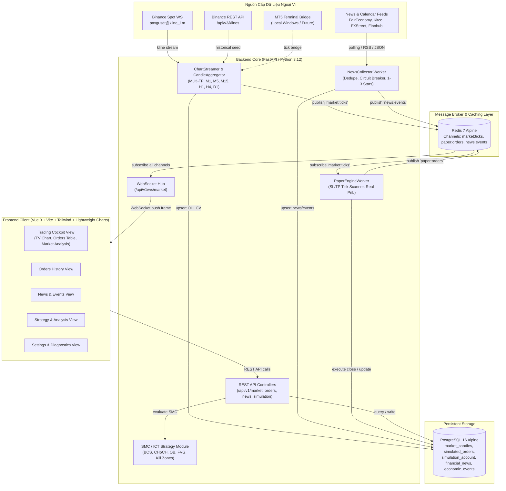
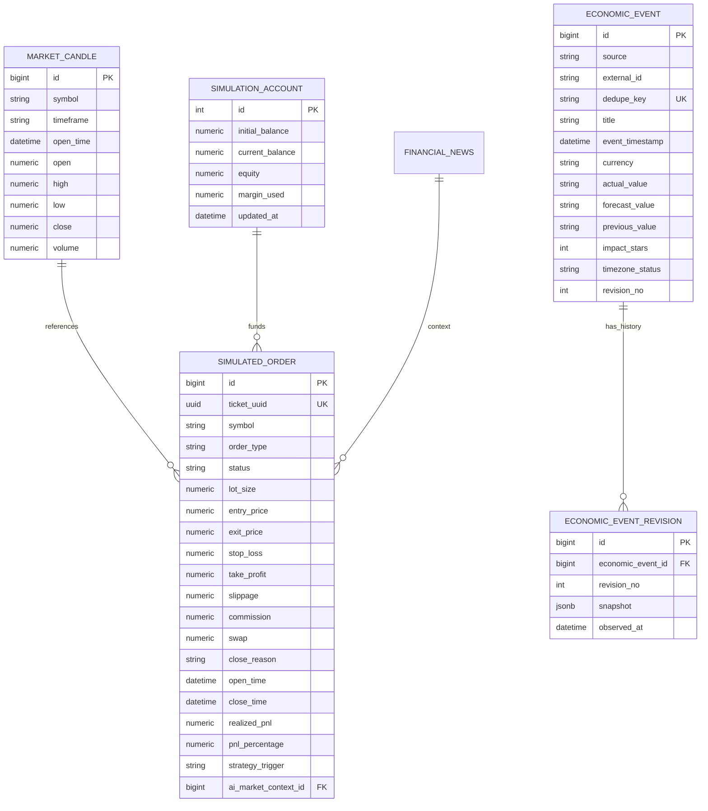

# TECHNICAL SYSTEM SPECIFICATION & ARCHITECTURE
# HỆ THỐNG THÔNG SỐ KỸ THUẬT & CÁCH THỨC HOẠT ĐỘNG CÁC CHỨC NĂNG

> **Dự án:** Trading System - Nền tảng Phân tích Kỹ thuật, Lịch kinh tế & Giả lập Thực thi Giao dịch Vàng (XAUUSD / PAXGUSDT)  
> **Phiên bản hiện tại:** Phase 02 - Sprint 02 (Completed & Verified)  
> **Ngày cập nhật:** 2026-10-08  
> **Môi trường hoạt động:** Docker Compose (Linux Containers) & Windows Host  

---

## MỤC LỤC
1. [Tổng quan Kiến trúc Hệ thống (System Architecture)](#1-tổng-quan-kiến-trúc-hệ-thống)
2. [Hạ tầng Docker & Cấu hình Cổng Mạng (Infrastructure & Ports)](#2-hạ-tầng-docker--cấu-hình-cổng-mạng)
3. [Luồng Dữ liệu Thị trường & Nạp Nến Real-time (Market Data Pipeline)](#3-luồng-dữ-liệu-thị-trường--nạp-nến-real-time)
4. [Động cơ Khớp lệnh Giả lập (Paper Execution Engine & Worker)](#4-động-cơ-khớp-lệnh-giả-lập)
5. [Động cơ Phân tích Chiến lược SMC / ICT (AI & Strategy Engine)](#5-động-cơ-phân-tích-chiến-lược-smc--ict)
6. [Hệ thống Thu thập Tin tức & Lịch Kinh tế (News & Macro Events Hub)](#6-hệ-thống-thu-thập-tin-tức--lịch-kinh-tế)
7. [Frontend Trading Cockpit & Trực quan hóa Giao diện](#7-frontend-trading-cockpit--trực-quan-hóa-giao-diện)
8. [Hợp đồng Giao tiếp: REST API & WebSocket Protocol](#8-hợp-đồng-giao-tiếp-rest-api--websocket-protocol)
9. [Mô hình Cơ sở Dữ liệu & Migrations (Database Schema)](#9-mô-hình-cơ-sở-dữ-liệu--migrations)
10. [Biến Môi trường & Quy trình Vận hành (Env & Operations)](#10-biến-môi-trường--quy-trình-vận-hành)

---

## 1. TỔNG QUAN KIẾN TRÚC HỆ THỐNG

Hệ thống được thiết kế theo kiến trúc **Modular Monolith** kết hợp **Event-Driven Architecture (Pub/Sub)**, tối ưu cho xử lý dữ liệu tick thị trường tần suất cao (sub-second) và phản hồi thời gian thực qua WebSockets.



---

## 2. HẠ TẦNG DOCKER & CẤU HÌNH CỔNG MẠNG

Toàn bộ hệ thống được cô lập và chạy trên cùng một bridge network nội bộ `trading-net`:

| Container Name | Service Name | Base Image / Build | Cổng Host (Mapped) | Cổng Nội bộ | Trách nhiệm chính |
| :--- | :--- | :--- | :--- | :--- | :--- |
| `trading_postgres` | `postgres` | `postgres:16-alpine` | `5432` | `5432` | Cơ sở dữ liệu quan hệ lưu nến, lệnh, tài khoản, tin tức. Volume: `pgdata`. |
| `trading_redis` | `redis` | `redis:7-alpine` | `6379` | `6379` | Message broker Pub/Sub kênh `market:ticks`, `paper:orders`, `news:events`. Volume: `redisdata`. |
| `trading_backend` | `backend` | `./backend/Dockerfile` (Python 3.12) | `8000` | `8000` | FastAPI server REST + WebSocket + 3 background workers (`chart-streamer`, `paper-worker`, `news-collector`). |
| `trading_frontend` | `frontend` | `./frontend/Dockerfile` (Nginx Alpine) | `3000` | `80` | Nginx reverse-proxy & phục vụ Vue 3 production SPA build (`dist/`). |
| `trading_mt5_bridge` | `mt5-bridge` | `./mt5-bridge/Dockerfile` | `5001` | `5001` | Dự phòng kết nối MetaTrader 5 (chạy môi trường Windows/Wine). |

---

## 3. LUỒNG DỮ LIỆU THỊ TRƯỜNG & NẠP NẾN REAL-TIME

### 3.1. Nguồn cấp dữ liệu độc lập 24/7 (Binance PAXGUSDT Feed)
* **Tài sản cơ sở:** PAX Gold (`PAXG`), neo 1:1 theo 1 Troy Ounce vàng ròng London Good Delivery, giao dịch 24/7 không đóng phiên cuối tuần.
* **Symbol Alias:** Hệ thống tự động map `PAXGUSDT` (từ Binance) sang symbol chuẩn của hệ thống là `XAUUSD`.
* **Cơ chế Synthetic ECN Spread (Spread mô phỏng ECN):**
  * Độ giãn spread cố định: **20 points** ($0.20 USD/oz).
  * Bid = $\text{Close} - 0.10$
  * Ask = $\text{Close} + 0.10$
  * Spread = $20$ points (0.20 USD).
* **Kết nối WebSocket:** `wss://stream.binance.com:9443/ws/paxgusdt@kline_1m` tự động tái kết nối với exponential backoff.

### 3.2. Bộ tổng hợp nến đa khung thời gian (`CandleAggregator`)
Hỗ trợ đầy đủ **6 khung thời gian**:
1. **M1** (1 phút / 60 giây)
2. **M5** (5 phút / 300 giây)
3. **M15** (15 phút / 900 giây) - *Khung trigger vào lệnh SMC*
4. **H1** (1 giờ / 3600 giây) - *Khung Dealing Range & POI*
5. **H4** (4 giờ / 14400 giây) - *Khung HTF Bias*
6. **D1** (1 ngày / 86400 giây) - *Khung HTF Bias*

* **Quy tắc tổng hợp (Aggregation Rules):**
  * Xác định mốc nến bắt đầu: $\text{bucket} = \text{timestamp\_seconds} - (\text{timestamp\_seconds} \pmod \text{seconds})$.
  * Khi nến mới bắt đầu: khởi tạo `open = bid`, `high = bid`, `low = bid`, `close = bid`, `volume = traded_volume`.
  * Trong thời gian nến chạy: cập nhật $\text{high} = \max(\text{high}, bid)$, $\text{low} = \min(\text{low}, bid)$, $\text{close} = bid$, cộng dồn `volume`.
  * Khử trùng lặp tick (Tick Deduplication): Sử dụng `deque` trượt 4,096 ticks để lọc các tick trùng lặp miligiây.

### 3.3. Cơ chế On-demand Seeding (Tự động nạp nến lịch sử)
Khi frontend chuyển sang khung thời gian bất kỳ (ví dụ H4, D1), nếu DB chưa có nến:
* Endpoint `GET /api/v1/market/history` tự động kích hoạt hàm `seed_history_for_timeframe()`:
  * Gọi Binance REST API: `https://api.binance.com/api/v3/klines?symbol=PAXGUSDT&interval={interval}&limit=500`.
  * Thực hiện câu lệnh PostgreSQL `ON CONFLICT (symbol, timeframe, open_time) DO UPDATE` để ghi đè hoặc bổ sung 500 nến chuẩn vào bảng `market_candles`.
  * Trả về ngay lập tức cho biểu đồ mà không gây nến rỗng (blank chart).

---

## 4. ĐỘNG CƠ KHỚP LỆNH GIẢ LẬP (PAPER EXECUTION ENGINE)

Module `PaperEngine` (`simulation/paper_engine.py`) và `PaperEngineWorker` (`simulation/paper_worker.py`) chạy nền liên tục.

### 4.1. Quy tắc mở lệnh (Order Fill)
* Lệnh **BUY**: Khớp theo giá **Ask** cộng trượt giá (Slippage):
  $$\text{Entry}_{\text{BUY}} = \text{Ask} + \text{Slippage}$$
  * Điều kiện hợp lệ: $\text{Stop Loss} < \text{Entry} < \text{Take Profit}$.
* Lệnh **SELL**: Khớp theo giá **Bid** trừ trượt giá (Slippage):
  $$\text{Entry}_{\text{SELL}} = \text{Bid} - \text{Slippage}$$
  * Điều kiện hợp lệ: $\text{Take Profit} < \text{Entry} < \text{Stop Loss}$.
* **Tham số mặc định:**
  * Contract Size: `100.0` (1 lot XAUUSD = 100 Troy Oz).
  * Slippage Points: `1.0 point` ($0.01 USD).
  * Commission: `$0.00` (có thể cấu hình trong Settings).

### 4.2. Cơ chế Quét SL/TP Tick-by-Tick
Worker lắng nghe channel Redis `market:ticks` (chỉ quét trên tick M1 để tránh lặp lại 6 lần):
* Với vị thế **BUY**:
  * Thoát lệnh tại giá **Bid**:
    * Chạm Stop Loss: $\text{Bid} \le \text{Stop Loss} \implies \text{Close Reason} = \text{"SL\_HIT"}$
    * Chạm Take Profit: $\text{Bid} \ge \text{Take Profit} \implies \text{Close Reason} = \text{"TP\_HIT"}$
* Với vị thế **SELL**:
  * Thoát lệnh tại giá **Ask**:
    * Chạm Stop Loss: $\text{Ask} \ge \text{Stop Loss} \implies \text{Close Reason} = \text{"SL\_HIT"}$
    * Chạm Take Profit: $\text{Ask} \le \text{Take Profit} \implies \text{Close Reason} = \text{"TP\_HIT"}$

### 4.3. Công thức tính Lợi nhuận / Thua lỗ (PnL)
$$\text{Realized PnL} = (\text{Exit Price} - \text{Entry Price}) \times \text{Direction} \times \text{Lots} \times 100$$
*(Trong đó: Direction = +1 cho BUY, -1 cho SELL)*

$$\text{PnL Percentage} = \frac{\text{Exit Price} - \text{Entry Price}}{\text{Entry Price}} \times 100 \times \text{Direction}$$

### 4.4. Quản lý Tài khoản Mô phỏng (`SimulationAccount`)
* Vốn ban đầu: `$10,000.00 USD`.
* Khi đóng lệnh:
  $$\text{Current Balance} \leftarrow \text{Current Balance} + \text{Realized PnL}$$
  $$\text{Equity} = \text{Current Balance} + \sum \text{Unrealized PnL}$$
  $$\text{Free Margin} = \text{Equity} - \text{Margin Used}$$
* Phát sự kiện WebSocket `order.update` với `event: "ORDER_CLOSED"` đến client ngay lập tức.

---

## 5. ĐỘNG CƠ PHÂN TÍCH CHIẾN LƯỢC SMC / ICT (AI & STRATEGY ENGINE)

Module `ai_engine` chứa các nguyên thủy Smart Money Concepts (SMC) và Inner Circle Trader (ICT) dạng **rule-based, 100% không look-ahead**.

### 5.1. Định nghĩa Toán học các Nguyên thủy SMC (`ai_engine/smc.py`)
1. **Fractal Swing High / Low:**
   * Cấu hình mặc định: $\text{left} = 3, \text{right} = 3$.
   * Một đỉnh chỉ được xác nhận là Swing High khi giá High tại nến $j$ là lớn nhất trong cửa sổ $2 \times 3 + 1 = 7$ nến:
     $$h_j = \max_{k=j-3}^{j+3}(h_k)$$
   * Tín hiệu chỉ được tính tại thời điểm $i \ge j + \text{right} = j + 3$ (ngăn ngừa tuyệt đối lỗi look-ahead bias).
2. **Break of Structure (BOS) & Change of Character (CHoCH):**
   * Điều kiện kích hoạt: Giá **ĐÓNG CỬA** ($Close$) vượt qua mức Swing gần nhất ($Close > Swing High$ hoặc $Close < Swing Low$).
   * Nếu nến phá vỡ cùng hướng xu hướng trước đó: **BOS** (tiếp diễn cấu trúc).
   * Nếu nến phá vỡ ngược hướng xu hướng trước đó: **CHoCH** (đảo chiều cấu trúc).
3. **Dealing Range & 50% Equilibrium:**
   * Đo khoảng cách giữa Swing High gần nhất ($H$) và Swing Low gần nhất ($L$):
     $$\text{Equilibrium} = \frac{H + L}{2}$$
   * Phân vùng:
     * $\text{Price} < \text{Equilibrium} \implies \mathbf{DISCOUNT}$ (Chỉ tìm cơ hội MUA).
     * $\text{Price} \ge \text{Equilibrium} \implies \mathbf{PREMIUM}$ (Chỉ tìm cơ hội BÁN).
4. **Fair Value Gap (FVG):**
   * Khoảng trống giá hình thành qua mô hình 3 nến liên tiếp:
     * Bullish FVG: $Low_3 > High_1$ với khoảng cách $Low_3 - High_1 \ge 0.3 \times \text{ATR}(14)$.
     * Bearish FVG: $High_3 < Low_1$ với khoảng cách $Low_1 - High_3 \ge 0.3 \times \text{ATR}(14)$.
5. **Order Block (OB):**
   * Nến ngược hướng cuối cùng tại đáy/đỉnh của chặng displacement (sóng đẩy mạnh) tạo ra BOS hoặc CHoCH.
6. **Liquidity Sweeps (Quét thanh khoản):**
   * Giá có bấc nến vượt qua Swing Level nhưng giá **ĐÓNG CỬA** rút chân quay trở lại bên trong phạm vi.

### 5.2. Khung Giờ Vàng Giao dịch (Kill Zones - `ai_engine/sessions.py`)
Hệ thống sử dụng thư viện `zoneinfo` để tự động bù trừ giờ mùa hè/mùa đông (DST - Daylight Saving Time) theo chuẩn giờ New York (`America/New_York`):

| Tên Phiên / Kill Zone | Khung Giờ New York (EDT/EST) | Giờ Việt Nam (ICT = UTC+7, DST Summer) | Giờ Việt Nam (ICT, Winter) | Đặc điểm giao dịch |
| :--- | :--- | :--- | :--- | :--- |
| **London Kill Zone** | 02:00 – 05:00 NY | 13:00 – 16:00 ICT | 14:00 – 17:00 ICT | Tạo đỉnh/đáy phiên Á, xác lập hướng trong ngày. |
| **New York AM Kill Zone** | 07:00 – 10:00 NY | 18:00 – 21:00 ICT | 19:00 – 22:00 ICT | Thanh khoản cao nhất, đón tin CPI/NFP/FOMC. |
| **New York PM Kill Zone** | 13:30 – 16:00 NY | 00:30 – 03:00 ICT | 01:30 – 04:00 ICT | Đảo chiều phiên chiều hoặc chốt phiên Mỹ. |
| **Asia Session** | 20:00 – 02:00 NY | 07:00 – 13:00 ICT | 08:00 – 14:00 ICT | Tích lũy biên độ hẹp (Asian Range). |
| **Silver Bullet** | 03:00–04:00, 10:00–11:00, 14:00–15:00 NY | Các khung 1 tiếng thanh khoản cao điểm | Quét FVG và tìm nhịp hồi 1R:2R nhanh. |

### 5.3. Quy trình Phân tích Chiến lược Đa khung (Multi-Timeframe Pipeline)
Quy trình thực thi theo 3 tầng nghiêm ngặt (`ai_engine/strategy.py`):
1. **Tầng 1 - HTF Bias (D1 & H4):** Xác định xu hướng vĩ mô qua Fractal Swing. Bắt buộc D1 và H4 phải đồng thuận xu hướng (`b4 == b1`).
2. **Tầng 2 - POI Selection (H1):** Xác định Dealing Range và Equilibrium. Chỉ chọn POI (OB hoặc FVG) nằm sâu trong vùng Discount (nếu Long) hoặc Premium (nếu Short).
3. **Tầng 3 - Trigger & Entry (M15):** 
   * Kiểm tra nến M15 đã chạm vào vùng POI H1 (`tap POI`).
   * Nến M15 đóng cửa tạo **CHoCH** xác nhận đổi cấu trúc.
   * Thời điểm diễn ra phải nằm trong cửa sổ **Kill Zone**.
   * Tính Stop Loss: Đáy vùng tích lũy trừ đi phần đệm $0.5 \times \text{ATR}(15)$.
   * Tính Take Profit: Mục tiêu đỉnh Swing High đối diện với tỷ lệ Risk:Reward $\ge 1:2.0$.

### 5.4. API Phân tích Thị trường (`GET /api/v1/market/analysis`)
Trả về cấu trúc phân tích động:
* **HTF Trend:** Trạng thái đồng thuận D1/H4, Swing High, Swing Low.
* **Intraday Trend:** Vùng Discount/Premium H1, con trỏ giá hiện tại so với Equilibrium.
* **Kịch bản đề xuất (Scenarios):**
  * *Primary Scenario (65% xác suất):* Mua thuận xu hướng tại vùng POI Discount.
  * *Alternative Scenario (35% xác suất):* Dự phòng nhịp quét Sell-Side Liquidity khi thủng mốc SL.
* **Predicted Setup:** Entry Zone, Entry Price, SL, TP, Risk:Reward, trạng thái `WAITING_TRIGGER`.
* **Invalidation Criteria:** 4 quy tắc hủy kịch bản (Thủng POI, Tin đỏ 3 sao ra trong 30p, Hết Kill Zone, R:R < 1:2.0).

---

## 6. HỆ THỐNG THU THẬP TIN TỨC & LỊCH KINH TẾ (NEWS & MACRO EVENTS HUB)

Module `NewsCollector` (`data_ingestion/news_worker.py`) chạy nền với chu kỳ polling định kỳ.

### 6.1. Bốn Nguồn Cung cấp Dữ liệu
1. **FairEconomy Calendar (JSON):** Nguồn chính cho Lịch kinh tế (`ff_calendar_thisweek.json`), cung cấp giờ phát hành, mã tiền tệ, mức độ tác động, số liệu Actual, Forecast, Previous.
2. **Kitco News (RSS XML):** Kênh tin tức chuyên sâu về Vàng thế giới và thị trường kim loại quý.
3. **FXStreet News (RSS XML):** Tin tức ngoại hối, chính sách tiền tệ Fed, nhận định phân tích kỹ thuật.
4. **Finnhub Market News (REST API):** Tin tức thị trường toàn cầu (yêu cầu API Key).

### 6.2. Cơ chế Xử lý & Chuẩn hóa Kỹ thuật
* **Phân loại tác động 1–3 sao:**
  * 3 sao (★★★ Cao / HIGH): CPI, Core CPI, Non-Farm Payrolls (NFP), FOMC Statement, Interest Rate Decision, GDP.
  * 2 sao (★★ Vừa / MEDIUM): Retail Sales, PPI, ISM Manufacturing PMI, Unemployment Claims.
  * 1 sao (★ Thấp / LOW): Các báo cáo phụ và chỉ số khảo sát khu vực.
* **Cơ chế Khử trùng lặp (Deduplication):** Sử dụng hàm băm SHA256 tạo `dedupe_key` dựa trên `source + title + published_at/event_time`.
* **Cơ chế Circuit Breaker & Fallback:**
  * Nếu một nguồn tin lỗi 2 lần liên tiếp $\implies$ Chuyển nguồn sang trạng thái `DEGRADED`, kích hoạt exponential backoff với header `Retry-After`.
  * Sau 2 lần thăm dò thành công liên tiếp $\implies$ Tự động phục hồi về trạng thái `HEALTHY`.
* **Snapshots & Versioning (`economic_event_revisions`):** Mỗi khi cơ quan thống kê điều chỉnh số liệu (ví dụ điều chỉnh Non-Farm tháng trước), hệ thống tăng `revision_no` và lưu snapshot cũ vào bảng revisions.

---

## 7. FRONTEND TRADING COCKPIT & TRỰC QUAN HÓA GIAO DIỆN

Frontend được xây dựng bằng **Vue 3 Composition API**, quản lý trạng thái bằng **Pinia/Reactive Stores**, giao diện Dark Theme Cyberpunk / Quant Trading chuyên nghiệp.

### 7.1. Cấu trúc Điều hướng Đa Màn hình (Main Navigation)
1. **Trading Cockpit:** Màn hình chính phục vụ quan sát thị trường và giao dịch:
   * **Cột trái (70%):** Biểu đồ TradingView Lightweight Charts $\to$ Bảng lệnh đang mở (Paper Positions) $\to$ Khối Phân tích & Kịch bản Thị trường (`MarketAnalysisStatus.vue`).
   * **Cột phải (30%):** Bảng tổng quan AI Insights $\to$ Dòng tin tức & Lịch kinh tế trong ngày (3 tabs Yesterday, Today, Tomorrow).
2. **Orders History:** Bảng tổng kết toàn bộ lệnh đã đóng, bộ lọc nâng cao, thống kê Win Rate, Profit Factor, Realized PnL.
3. **News & Events:** Trung tâm tin tức vĩ mô toàn diện, giám sát trạng thái 4 nguồn tin (Health/Latency), tab Economic Calendar và tab Breaking News.
4. **Strategy & Analysis:** Toàn bộ hệ tri thức SMC, quy trình đa khung thời gian, thư viện khái niệm, ma trận quản trị rủi ro, checklist 7 bước.
5. **Settings & Diagnostics:** Giám sát PostgreSQL/Redis/Binance, chẩn đoán ping API latency, thiết lập tham số trượt giá, lot size mặc định.

### 7.2. Tối ưu Đồ họa Biểu đồ (`TradingViewChart.vue`)
* **Thư viện:** TradingView Lightweight Charts (v4.x Canvas-based).
* **Đường giá vị thế (Price Lines):**
  * Entry Price: Đường xanh lam nét đứt (`#2962ff`, style 2).
  * Stop Loss: Đường đỏ nét đứt (`#ef5350`, style 2).
  * Take Profit: Đường xanh lá nét đứt (`#26a69a`, style 2).
* **Markers Vào/Đoán/Thoát Lệnh (Mũi tên Tối giản):**
  * Lệnh BUY: Mũi tên xanh ngọc hướng lên (`arrowUp`, `belowBar`, `#26a69a`, size 1).
  * Lệnh SELL & Thoát lệnh BUY (Exit Price): Mũi tên đỏ cam hướng xuống (`arrowDown`, `aboveBar`, `#ef5350`, size 1).
  * **Khử trùng lặp trên nến (Candle-level Deduplication):** Sử dụng cấu trúc `Set` lọc theo timestamp nến đã snap. Nếu một nến có nhiều lệnh (DCA hoặc khớp lệnh cùng lúc), biểu đồ chỉ hiển thị duy nhất **1 mũi tên** cho mỗi chiều.
  * **Thuật toán Snap Nến (Binary Search):** Tự động snap thời gian timestamp của lệnh về đúng `open_time` của cây nến thuộc khung thời gian đang chọn (M1–D1), loại bỏ lỗi assertion failed của Lightweight Charts.

### 7.3. Khối Trạng thái Phân tích Thị trường (`MarketAnalysisStatus.vue`)
* Tích hợp thanh trượt Dealing Range H1 (Low $\to$ 50% Equilibrium $\to$ High) với con trỏ định vị giá live.
* Tích hợp **Dynamic Lot Size Calculator:** Cho phép trader chọn rủi ro (0.5%, 1.0%, 1.5%, 2.0%), tự động tính toán khối lượng Lot chuẩn:
  $$\text{Lot Size} = \frac{\text{Equity} \times \text{Risk \%}}{|\text{Entry} - \text{SL}| \times 100}$$
* Hiển thị chi tiết 4 tiêu chí hủy kịch bản bảo vệ vốn (Invalidation badges).

---

## 8. HỢP ĐỒNG GIAO TIẾP: REST API & WEBSOCKET PROTOCOL

### 8.1. Danh mục Endpoints REST API (Base: `/api/v1`)

| Phương thức | Endpoint | Tham số Query / Body | Chức năng |
| :--- | :--- | :--- | :--- |
| `GET` | `/health` | Không | Kiểm tra trạng thái hệ thống, ping kết nối DB và Redis. |
| `GET` | `/api/v1/market/history` | `symbol` (str), `timeframe` (str), `limit` (int, 1-5000) | Lấy danh sách nến lịch sử. Tự động seed từ Binance nếu trống. |
| `GET` | `/api/v1/market/analysis` | `symbol` (str) | Lấy dữ liệu phân tích SMC, kịch bản giao dịch, setup dự kiến. |
| `GET` | `/api/v1/orders` | `limit` (int, 1-200) | Lấy danh sách lệnh giả lập (cả lệnh OPEN và CLOSED). |
| `POST` | `/api/v1/orders` | JSON: `symbol`, `order_type`, `lot_size`, `stop_loss`, `take_profit`, `entry_price?` | Đặt lệnh mới qua Paper Trading Engine. |
| `POST` | `/api/v1/orders/{id}/close` | JSON: `reason` (mặc định `"MANUAL_CLOSE"`) | Đóng thủ công một vị thế đang mở theo giá thị trường hiện tại. |
| `GET` | `/api/v1/simulation/account` | Không | Lấy số dư tài khoản, Equity, Margin Used, Free Margin, Open Count. |
| `GET` | `/api/v1/news` | `limit` (int, 1-200) | Lấy danh sách tin tức tức thời kèm điểm tâm lý và số sao. |
| `GET` | `/api/v1/news/events` | `limit` (int, 1-200) | Lấy danh sách sự kiện lịch kinh tế (Actual/Forecast/Prev). |
| `GET` | `/api/v1/news/status` | Không | Trạng thái sức khỏe, số lượt nạp của 4 nguồn tin. |

### 8.2. WebSocket Multiplexing Stream (`/api/v1/ws/market`)
Hệ thống sử dụng một endpoint WebSocket duy nhất phân phối 3 loại event frame qua thuộc tính `type`:

#### 1. Frame Cập nhật Biểu đồ (`type: "chart.update"`)
```json
{
  "type": "chart.update",
  "symbol": "XAUUSD",
  "timeframe": "M1",
  "candle": {
    "time": 1774972800,
    "open": 2685.20,
    "high": 2686.10,
    "low": 2684.90,
    "close": 2685.80,
    "volume": 42.50
  },
  "price": {
    "bid": 2685.70,
    "ask": 2685.90,
    "spread": 20,
    "value": 2685.80
  }
}
```

#### 2. Frame Cập nhật Lệnh (`type: "order.update"`)
```json
{
  "type": "order.update",
  "event": "ORDER_CLOSED",
  "data": {
    "id": 101,
    "ticket_uuid": "3fa85f64-5717-4562-b3fc-2c963f66afa6",
    "symbol": "XAUUSD",
    "order_type": "BUY",
    "status": "CLOSED",
    "lot_size": 0.20,
    "entry_price": 2680.00,
    "exit_price": 2690.00,
    "stop_loss": 2675.00,
    "take_profit": 2690.00,
    "realized_pnl": 200.00,
    "pnl_percentage": 0.37,
    "close_reason": "TP_HIT",
    "close_time": "2026-10-08T14:30:00Z"
  }
}
```

#### 3. Frame Cập nhật Tin tức (`type: "news.upsert"`)
```json
{
  "type": "news.upsert",
  "kind": "economic_event",
  "data": {
    "id": 55,
    "source": "fair_economy",
    "title": "US Core CPI m/m",
    "currency": "USD",
    "actual_value": "0.3%",
    "forecast_value": "0.2%",
    "impact_stars": 3,
    "event_timestamp": "2026-10-08T12:30:00Z"
  }
}
```

---

## 9. MÔ HÌNH CƠ SỞ DỮ LIỆU & MIGRATIONS

Hệ thống quản lý schema qua các tệp migration SQL lũy tiến (`backend/migrations/`):
* `0001_phase1.sql`: Schema cơ bản cho nến, lệnh và tin tức.
* `0002_phase2_sprint1.sql`: Thêm bảng `economic_events`, `economic_event_revisions`, các cột sao, revision.
* `0003_phase2_sprint2.sql`: Thêm bảng `simulation_account`, bổ sung `ticket_uuid`, `slippage`, `commission`, `swap`, `close_reason` cho `simulated_orders`.



---

## 10. BIẾN MÔI TRƯỜNG & QUY TRÌNH VẬN HÀNH

### 10.1. Danh mục Biến Môi trường (`.env` / `docker-compose.yml`)

```bash
# Database PostgreSQL
POSTGRES_DB=trading_system
POSTGRES_USER=quant_user
POSTGRES_PASSWORD=secure_password
POSTGRES_PORT=5432

# Redis Pub/Sub
REDIS_PORT=6379

# External News APIs
FAIR_ECONOMY_CALENDAR_URL=https://nfs.faireconomy.media/ff_calendar_thisweek.json
KITCO_NEWS_RSS_URL=https://news.kitco.com/rss/kitconewsfeed.xml
FXSTREET_NEWS_RSS_URL=https://www.fxstreet.com/rss/news
FINNHUB_API_KEY=your_optional_api_key
FINNHUB_ECONOMIC_CALENDAR_ENABLED=false

# MT5 Bridge Connector (Optional)
MT5_BRIDGE_URL=http://mt5-bridge:5001
MT5_DEMO_LOGIN=
MT5_DEMO_PASSWORD=
MT5_DEMO_SERVER=
```

### 10.2. Lệnh Vận hành & Kiểm thử Thường dùng

```powershell
# 1. Khởi động toàn bộ cụm dịch vụ qua Docker Compose
docker compose up -d --build

# 2. Kiểm tra log của backend container
docker logs -f trading_backend

# 3. Chạy toàn bộ bộ kiểm thử đơn vị & tích hợp (Unit & Integration Tests)
docker exec trading_backend pytest -v

# 4. Kiểm tra sức khỏe hệ thống (Health Check)
curl http://localhost:8000/health

# 5. Build lại giao diện frontend khi có cập nhật
cd frontend
npm run build
docker restart trading_frontend
```
